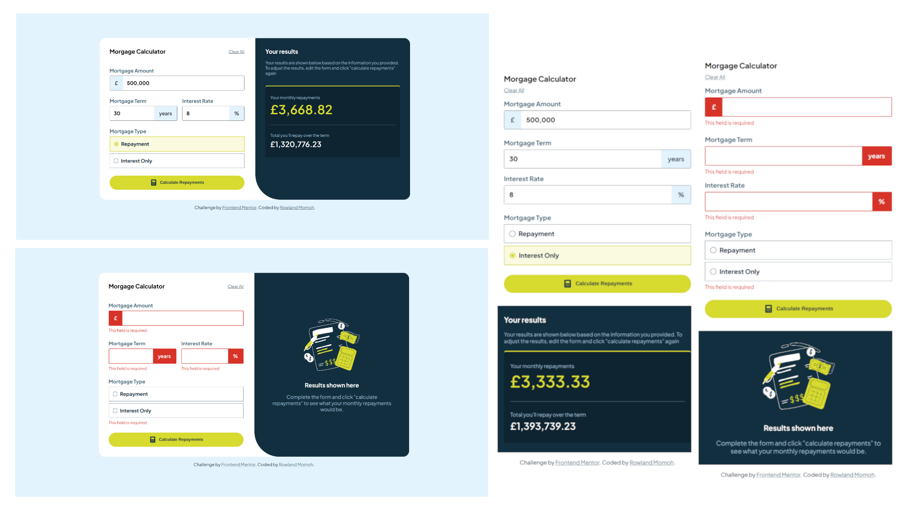

# Frontend Mentor - Mortgage repayment calculator solution

This is a solution to the [Mortgage repayment calculator challenge on Frontend Mentor](https://www.frontendmentor.io/challenges/mortgage-repayment-calculator-Galx1LXK73). Frontend Mentor challenges help you improve your coding skills by building realistic projects. 

## Table of contents

- [Overview](#overview)
  - [The challenge](#the-challenge)
  - [Screenshot](#screenshot)
  - [Links](#links)
- [My process](#my-process)
  - [Built with](#built-with)
  - [What I learned](#what-i-learned)
  - [Continued development](#continued-development)
  - [Useful resources](#useful-resources)
- [Author](#author)
- [Acknowledgments](#acknowledgments)


## Overview

### The challenge

Users should be able to:

- Input mortgage information and see monthly repayment and total repayment amounts after submitting the form
- See form validation messages if any field is incomplete
- Complete the form only using their keyboard
- View the optimal layout for the interface depending on their device's screen size
- See hover and focus states for all interactive elements on the page

### Screenshot



### Links

- Solution URL: [Click here](https://your-solution-url.com)
- Live Site URL: [Click here](https://your-live-site-url.com)

## My process

### Built with

- Semantic HTML5 markup
- CSS custom properties
- Flexbox
- Mobile-first workflow
- Vanilla JavaScript


### What I learned

I learnt how to overide the browser's default radio input appearance and to design my own.
```css
input[type='radio'] {
    appearance: none;
    width: 15px; height: 15px;
    border: 1px solid var(--slate-900);
    border-radius: 50%;
    cursor: pointer;
    position: relative;
    background-color: var(--white);
}

input[type='radio']::before {
    content: '';
    width: 9px; height: 9px;
    border-radius: 50%;
    position: absolute;
    top: 50%; left: 50%;
    transform: translate(-50%, -50%);
}


input[type='radio']:checked {
    border: 2px solid var(--lime);
}

input[type='radio']:checked::before {
    background-color: var(--lime);
}
```

I learnt more about DOM manipulations with JavaScript and I used different event listeners and handlers
```js
form.addEventListener('submit', handleForm)
form.addEventListener('input', e => {
    if(e.target.tagName === "INPUT") { handleInputs(e.target)}
})
form.addEventListener('focusin', e => {
    if(e.target.tagName === "INPUT") { handleFocus(e.target)}
})
form.addEventListener('focusout', e => {
    if(e.target.tagName === "INPUT") { handleBlur(e.target)}
})

clearBtn.addEventListener('click', handleReset)
radios.forEach(radio => { radio.addEventListener('change', handleRadio) })
```

### Continued development

I'll keep learning and practicing to improve my skills.


### Useful resources

- [MDN web docs](https://developer.mozilla.org/en-US/docs/Learn_web_development/Core/Scripting/Events) - This helped me learn and understand events in JavaScript

## Author

- Website - [Rowland Momoh](https://rowland-momoh.netlify.app/://www.your-site.com)
- Frontend Mentor - [@rowleks](https://www.frontendmentor.io/profile/rowleks)
- Twitter - [@Rolexks](https://x.com/Rolexks)

## Acknowledgments

I'm grateful to frontend mentor for this challenge as it helps build my web development skills further. I also thank google, w3school, MDN web docs and other similar sites for their amazing and helpful resources.
